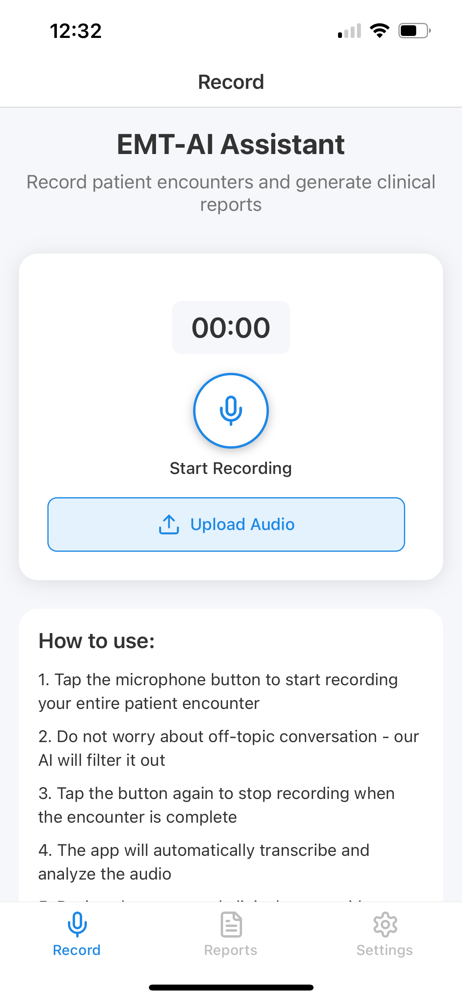

# EMT-AI Agent

## Overview
The EMT-AI Agent is an intelligent web application designed to assist EMTs (Emergency Medical Technicians) by automating documentation and administrative tasks during patient care. The app listens to EMT-patient interactions in real-time, processes the audio, and automatically generates structured documentation (e.g., SOAP notes) for each call.

<p float="left">
  
  
  
  
</p>

## Features
- **Audio Recording**: EMTs can start and stop recording their interactions through the web interface. Supports both browser-based recording and file uploads (MP3, OGG, WEBM, FLAC, WAV).
- **Speech-to-Text**: Utilizes Vosk (offline model) to transcribe audio to text with word-level timestamps.
- **Natural Language Processing (NLP)**: The application processes the transcriptions using spaCy and custom NLP logic to extract key details like patient demographics, vital signs, symptoms, and treatments.
- **SOAP Notes**: Automatically generates SOAP (Subjective, Objective, Assessment, Plan) notes for each interaction, ready for review and export.
- **FHIR Export**: Supports exporting diagnostic reports to configurable FHIR servers for integration with healthcare systems.
- **Real-time Logging**: Logs all interactions for debugging and auditing purposes.
- **Configuration Management**: Easily configurable with `.env` files to customize settings such as FHIR server URLs, API keys, etc.

## Technologies Used
- **Backend**: Python + FastAPI
- **Frontend**: Plain HTML/JavaScript (no frameworks)
- **Speech-to-Text**: Vosk (offline model)
- **NLP**: spaCy + custom regex/word2number for extracting patient information
- **Templating**: Jinja2 for rendering SOAP notes
- **Audio Conversion**: imageio-ffmpeg or WAV uploads
- **Database**: Not required for this project (file-based or API-based storage can be integrated)

## Setup Instructions

### Prerequisites
1. Python 3.x
2. FastAPI
3. Vosk (offline model)
4. spaCy
5. Jinja2
6. FFmpeg (optional for audio conversion)

### Installation

1. Clone the repository:
   ```bash
   git clone https://github.com/tusharj03/EMT-AI-Agent.git
   cd EMT-AI-Agent
2. Install the required Python dependencies
   ```bash
     pip install -r requirements.txt
4. Start the backend
   ```bash
    uvicorn main:app --reload

